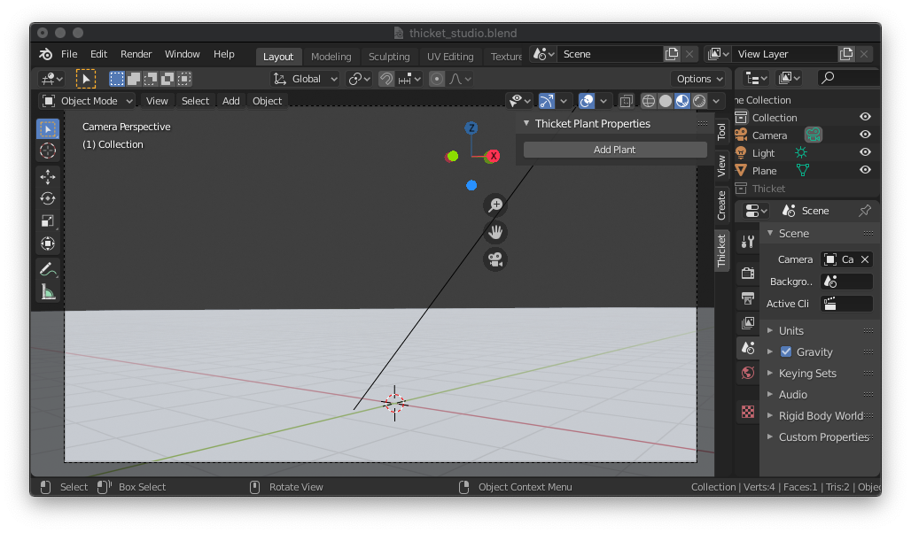
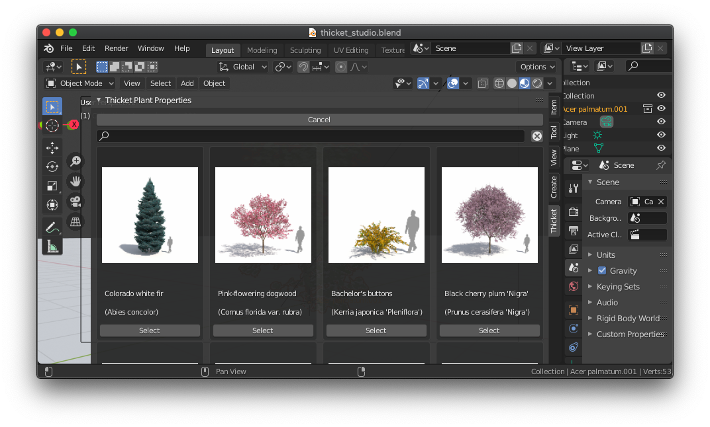
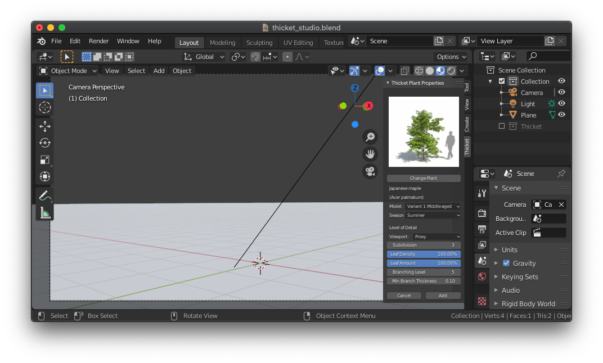
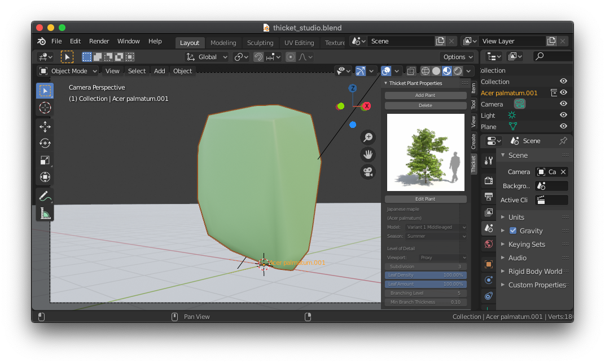
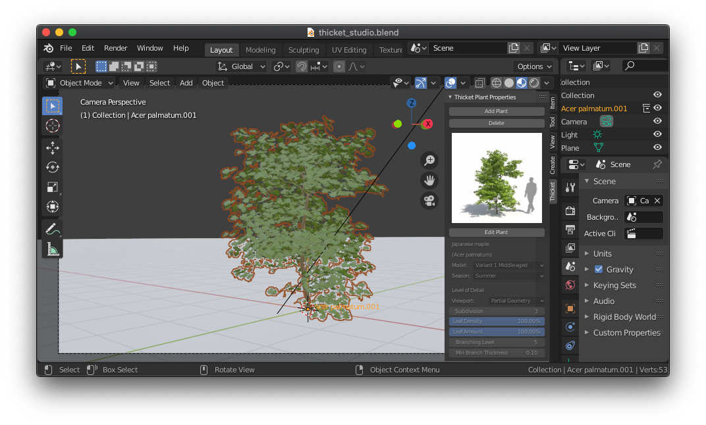
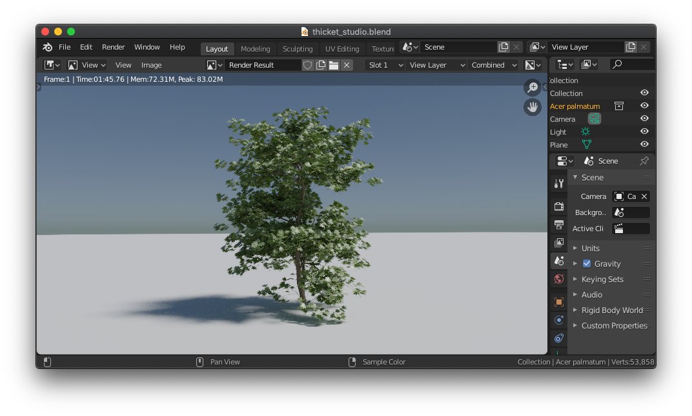
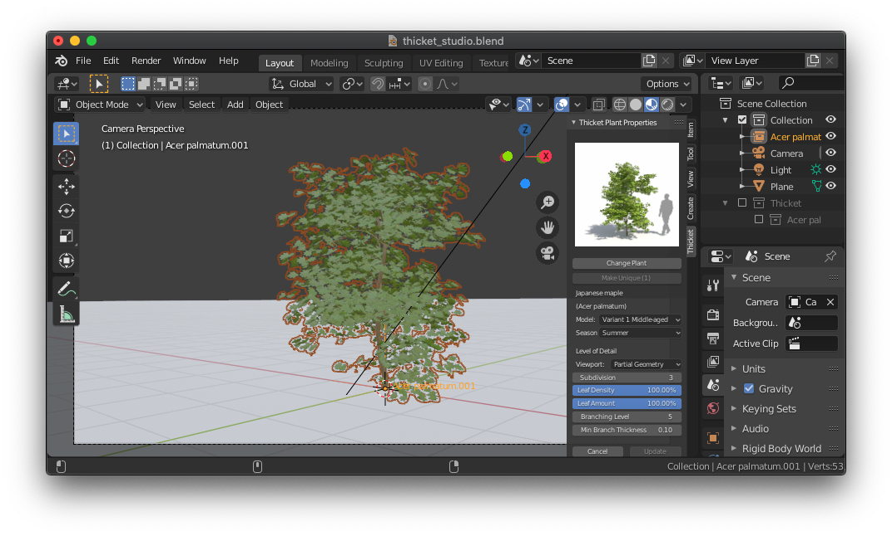
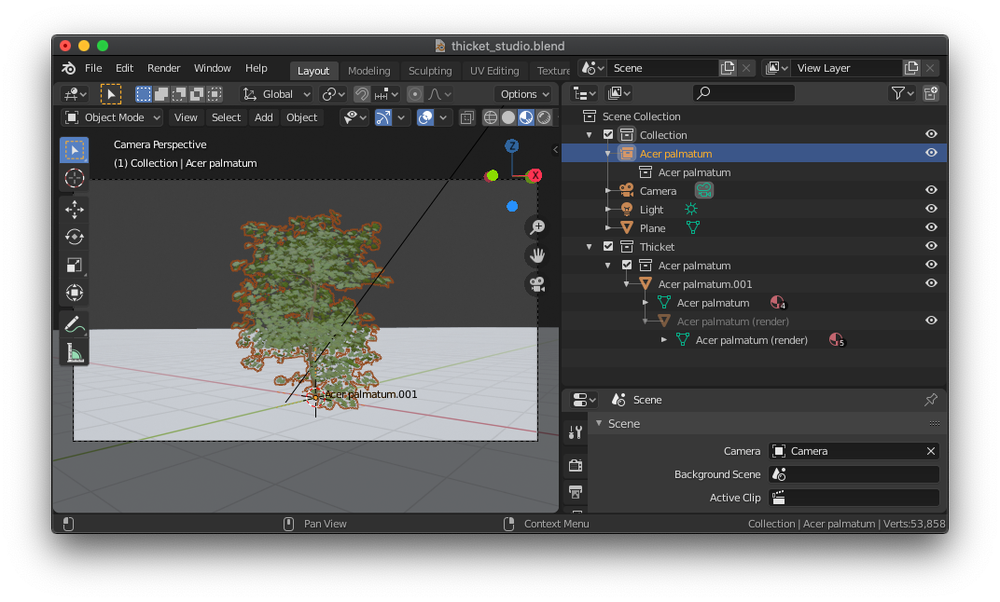

# Thicket
## Laubwerk Plants Add-on for Blender
Thicket is a [Blender](http://www.blender.org) Add-on to import [Laubwerk Plants](http://www.laubwerk.com) high resolution plant and tree models.

Thicket is an open source community developed project using the Laubwerk Python SDK. While not affiliated with or officially supported by Laubwerk GmbH, this project would not be possible without Laubwerk's efforts to answer questions and address issues during the development of Thicket.

Using Laubwerk's level of detail controls, Thicket keeps the Blender viewport responsive and renderings photo-realistic, like this shot of a Japanese Maple (Acer Palmatum).

## Features
Thicket generates separate viewport and render models, supporting various levels of detail for each. The viewport can display a low poly proxy (convex hull) or a partial geometry model in any of Blender's viewport modes. The rendered model geometry is generated using various level of detail controls.

* Sidebar "N Panel" UI
  * Visual plant selection (gallery)
  * Update existing plants
  * Update all identical instances at once
  * Make instances unique
  * Smart delete to manage scene size
* Separate viewport and render models
* Collection instancing
* Material nodes
* Viewport model level of detail
  * Proxy (Convex Hull)
  * Partial geometry
* Render model level of detail
  * Subdivision
  * Leaf density
  * Leaf amount
  * Branching level
  * Branch thickness

## Install
Thicket is in active development toward the initial 1.0 release, which will
release packages for download. Until then, please follow these steps to try it
out.

* Download and install the prerequisites
  * [Blender](http://www.blender.org/) 2.80 or later. The plugin is known to run with [Blender 2.82](http://www.blender.org/features/past-releases/2-82/).
  * Laubwerk Python SDK 1.0.32 or later, provided by all Laubwerk Plant Kits, including the [Plants Kit Freebie](http://www.laubwerk.com/store/plants-kit-freebie).
* Installation options
  * Latest from GitHub
    * Exit Blender
    * Clone the `thicket` git repository into the Blender `addons` folder:
      * Mac: `~/Library/Blender/2.80/scripts/addons/thicket`
      * Windows: `%AppData%\Blender Foundation\Blender\2.80\scripts\addons\thicket`
    * Start Blender
  * From a release Zip file
    * Download the latest release zip file from the [Releases Tab](/../../releases/)
    * Start Blender
    * Choose `Edit -> Preferences -> Add-ons -> Install`
    * Select the zip file and click `Install Add-on`
* Configure Thicket
  * Choose `Edit -> Preferences...`
  * Select the `Add-ons` tab and search for `thicket`
  * Check the box to enable the row `Import: Thicket: Laubwerk Plants Add-on for
    Blender`
    * If you have more than one version installed, be sure to only enable one at
      a time
  * Click the arrow to expand the add-on preferences
  * Enter the Laubwerk install path. The box will be red until a valid path is
    entered, then the Laubwerk SDK version will be displayed below the path.
  * Click `Rebuild Database`. This will take a few minutes depending on your computer and the number of Laubwerk Plants Kits installed.
  * When it completes, the number of plants in the database is displayed
* Thicket is now ready to use (see Usage)

## Usage
### N Panel
Thicket adds a Blender N Panel to Add, Edit, and Delete plants. Access the panel by pressing `n` and clicking on the `Thicket` tab.

### Add Plant
To add a plant, click `Add Plant` and select from the gallery presented. You can
resize the panel to show up to 5 columns of plants.

Once selected, the panel presents the plant model, season, and level of detail options.

The image preview will update when you change the `Model` variant and age. You can configure the season and level of detail properties:

Plant Model
* Model: Select variant and age. There are typically 3 variants of each plant,
  as well as 3 ages for each variant.
* Season: Affect plant's foliage, color, and flowers.

Level of Detail Settings
* Viewport: Control the model displayed in the viewport
  * Proxy: low poly proxy (convex hull)
  * Partial Geometry: low detail version of the render model
* Subdivision: Control the number of edges in a branch cross-section (0 is square)
* Leaf Density: Control how full the foliage appears
* Leaf Amount: Control the number of leaves used to reach the specified density
  (fewer leaves results in larger individual leaves)
* Maximum Level: Limit the number of branching levels off the trunk
* Minimum Thickness: Eliminate branches smaller than this value

You can return the gallery to select a different plant with `Change Plant`, add the current plant with `Add`, and cancel the operation with `Cancel`.

Adding Acer Palmatum with Viewport `Proxy` selected, loads the convex hull into the viewport:

Importing the same plant with Viewport `Partial Geometry` selected loads a low detail
version of the render model into the viewport:

The rendered model is the same for each, resulting in the following rendered image:

### Edit Plant
To edit the properties after a plant is added, select the plant in the viewport and press `Edit Plant` under the thumbnail in the panel. Here, you can change the plant and any of the options. Pressing `Update` will replace the selected plant's template, changing all plants using the same template. To change only the selected plant object, press `Make Unique (#)`. The number of "sibling" plants (plants with the same template) is indicated by `(#)` in the `Make Unique (#)` label.

### Delete Plants
To delete a plant, avoid using `x`. Instead, select the plant and press `Delete` in the panel. This will remove the plant instance from the viewport and will also remove the template plant when the last instance is removed. This will help keep your Blender file as small as possible.

## Collections and Instancing
Thicket creates a template for each plant added, and places them in a top level collection named "Thicket" which is excluded from the View Layer by default. Each template is a collection consisting of the viewport object and the render object as a child of the viewport object. Object visibility settings determine which object is visible in the viewport, and which is visible for rendering. At import time, a Collection Instance of the template collection is added to the main scene collection. This is the object that is visible after import.

The object model is shown in the image below by checking the Thicket collection and expanding the template collection and object hierarchy:

The collection instance can be duplicated with `Shift+D` to add a second identical plant instance to the scene, without doubling the memory used. Because Collection Instances are displayed in the viewport, modifying the template in the Thicket collection will be reflected in all the instances (this is what Editing and Updating a plant with the Thicket N Panel does).

In short, leave the Thicket collection unchecked and duplicate the Collection Instance in the scene to make memory efficient copies of plants you can update in groups. To make a plant unique, select it, press `Edit Plant`, and then `Make Unique (#)`.

## Report an Issue
Thicket is an open source project that is not affiliated with Laubwerk GmbH. If you think you have found a problem or a bug with Thicket, please [Check Existing Issues](/../../issues) to see if someone has already reported it. If not, please [Create a New Issue](/../../issues/new/choose), providing as much detail as possible to help us recreate the problem. Please do not contact Laubwerk directly.

## Contributing ##
See [CONTRIBUTING](CONTRIBUTING.md) for more information.
